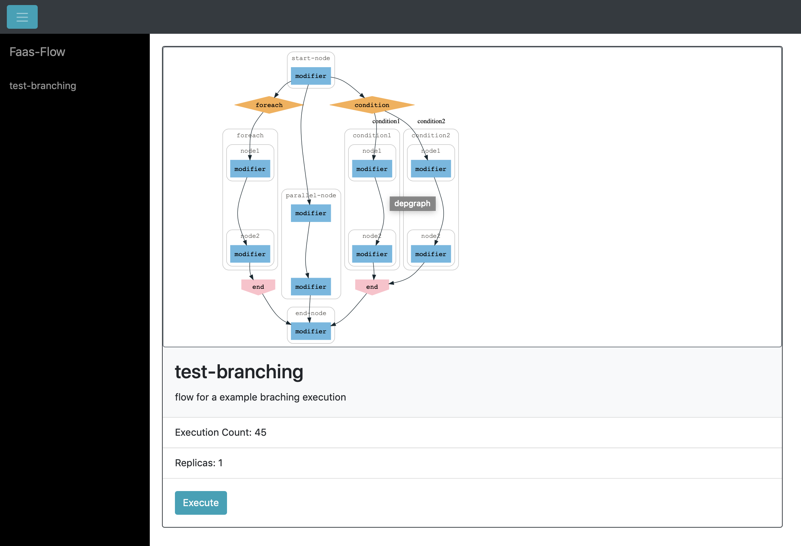
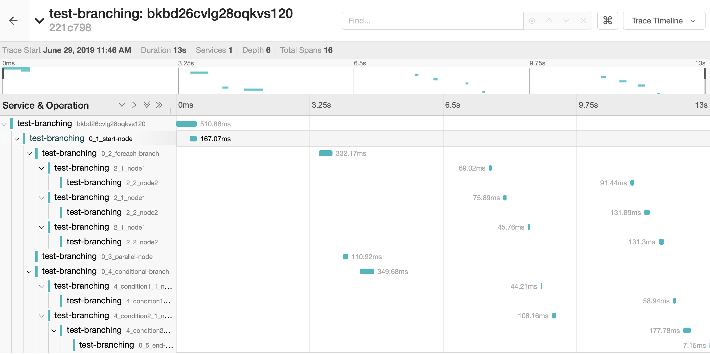

# branching-in-faas-flow
Super simple examples with dynamic branching in faas-flow



### Getting Started 
1. Deploy Openfaas
2. Deploy Consul as a statestore, follow : https://github.com/s8sg/faas-flow-consul-statestore
3. Deploy Jaguer Tracing, follow: https://www.jaegertracing.io/docs/1.8/getting-started/
4. Review your configuration at `flow.yml`
```
environment:
  workflow_name: "test-branching"
  gateway: "gateway:8080"
  enable_tracing: true
  trace_server: "jaegertracing:5775"  
  enable_hmac: false
  consul_url: "statestore_consul:8500"
  consul_dc: "dc1"
```
5. Deploy the flow-function
```
faas build
faas deploy
```
6. Request the flow
```
curl http://127.0.0.1:8080/function/test-branching
``` 

Tracing Information in Jaguer Tracing   

